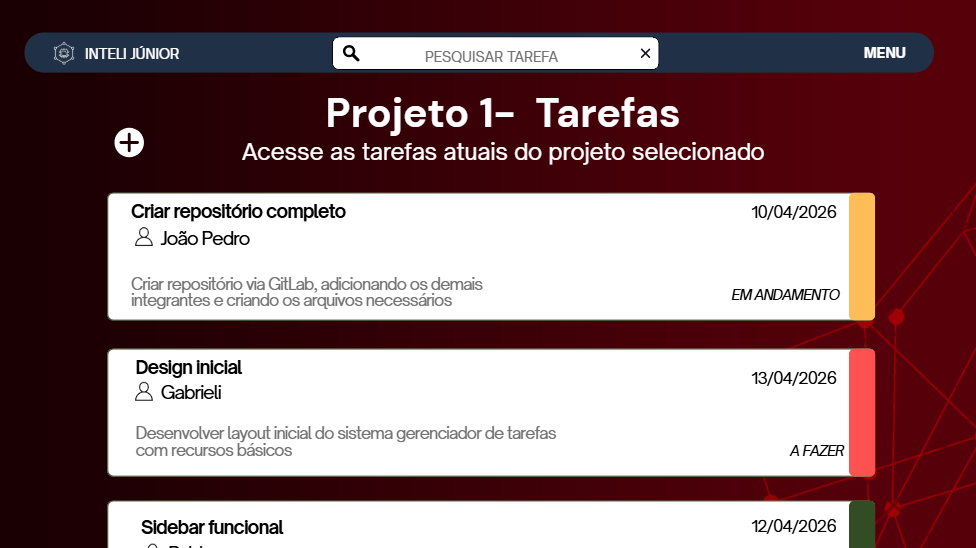
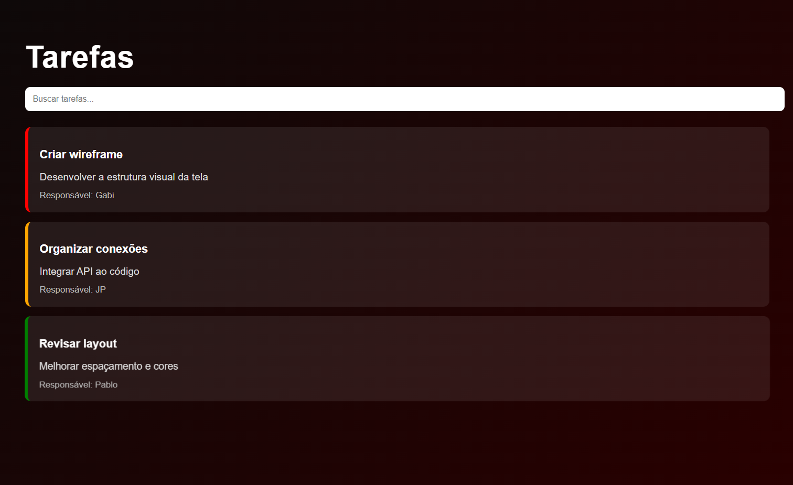
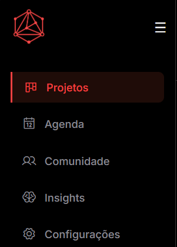
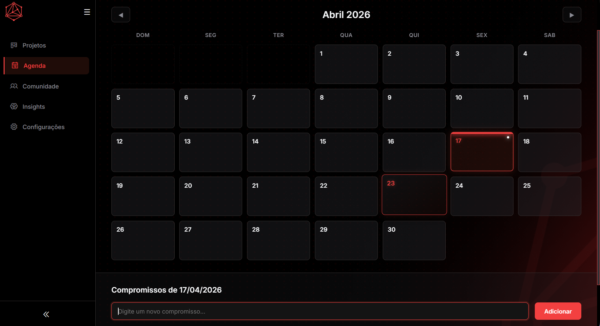
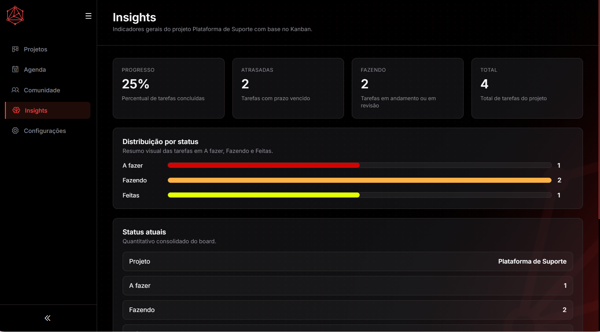

# Relatório de Contribuições- Trainee Inteli Júnior
## Gabrieli Marques Battini

### Introdução

Durante o desenvolvimento do case, atuei tanto na construção técnica da interface quanto na organização do time como **Scrum Master**, buscando garantir não apenas a entrega funcional, mas também a coerência do projeto como um todo.

Minhas contribuições envolveram a criação da tela de tarefas, o desenvolvimento da estrutura inicial da sidebar com navegação entre telas, e a implementação da tela de agenda e da tela de insights, pensadas como diferenciais para organização de prazos. 

Além disso, me mantive disponível para apoiar os demais integrantes sempre que necessário, contribuindo para o avanço coletivo do projeto.

---

## Design e Estrutura Inicial

Uma das minhas primeiras entregas foi o desenvolvimento do wireframe da tela de tarefas, onde defini a organização visual da interface e a disposição dos elementos.

O foco principal foi criar uma estrutura simples, clara e alinhada com plataformas reais de gestão de projetos.

> **Wireframe da tela de tarefas:**
> 
## Dependências

Para funcionamento completo da tela de tarefas, são necessárias:

- Integração com API de tarefas:
  Responsável por fornecer os dados das tarefas (título, descrição, responsável, status, prazo).

- Identificação do projeto:
  A tela depende de um projeto selecionado previamente para carregar as tarefas correspondentes.

- Navegação via sidebar:
  Acesso à tela ocorre através da navegação principal do sistema.

- Estrutura de dados padronizada:
  As tarefas devem conter informações como título, status e responsável para correta exibição.

- Integração futura com Kanban:
  A tela de tarefas deve refletir os mesmos dados utilizados no quadro Kanban, garantindo consistência.
---

## Tela de Tarefas

Fui responsável pela criação inicial da tela de tarefas, que tem como objetivo permitir a visualização organizada das atividades do projeto.

A interface foi estruturada utilizando cards, cada um contendo:
- Título da tarefa
- Descrição
- Responsável
- Indicador visual de prioridade

> **Visual da tela de tarefas inicial:**
> 

---

## Sidebar e Navegação

Desenvolvi a estrutura da sidebar, que posteriormente evoluí para incluir a navegação entre as diferentes telas do sistema.

A ideia foi aproximar a experiência do usuário de sistemas reais, organizando as funcionalidades em seções claras como:
- Projetos
- Insights
- Agenda
- Comunidade
- Configurações

Essa estrutura foi essencial para dar coerência ao fluxo de navegação da aplicação.

> **Sidebar com navegação:**
> 

---

## Tela de Agenda (Diferencial)

Como extensão do escopo inicial, desenvolvi a tela de agenda, com o objetivo de auxiliar na organização de prazos e compromissos do projeto.

A proposta foi criar uma visão complementar ao Kanban, permitindo que os usuários acompanhem datas importantes de forma visual. A agenda foi pensada como um recurso estratégico para melhorar o planejamento das tarefas.

> **Tela de agenda:**
> 

---
## Tela de Insights (Diferencial)

Fui responsável pelo desenvolvimento da tela de insights, com o objetivo de transformar os dados do Kanban em informações visuais e estratégicas para o usuário.

Essa funcionalidade foi construída consumindo diretamente a API do projeto, utilizando o mesmo endpoint das tarefas, garantindo consistência entre as telas.

Os insights apresentam:

- Distribuição de tarefas por status:
  - A fazer
  - Em andamento / revisão
  - Concluídas

- Cálculo de progresso do projeto baseado nas tarefas concluídas

- Identificação de tarefas atrasadas com base na data limite

- Resumo geral do estado atual do projeto

A visualização foi construída utilizando barras dinâmicas, permitindo uma leitura rápida da situação do projeto.

> **Tela de insights:**
> 

---

## Atuação como Scrum Master

Durante o desenvolvimento, atuei como **Scrum Master**, sendo responsável por:

- Organizar a distribuição de tarefas entre os integrantes
- Acompanhar o progresso do time
- Garantir alinhamento entre as entregas individuais e o objetivo do projeto
- Apoiar membros com dúvidas técnicas ou de organização

Minha atuação foi voltada para manter o fluxo de desenvolvimento contínuo e colaborativo, garantindo que todos conseguissem evoluir dentro do tempo proposto. Realizei as atribuições de tarefas respeitando o nível técnico dos colegas e o tempo disponível dos mesmos, porém sem deixar para trás as prioridades a serem realizadas.  

Através de um documento compartilhado, deleguei atribuições viáveis e com prazos estabelecidos ao longo da semana. Também organizei encontros diariamente e mantive a comunicação constante para verificar o andamento das tarefas e evolução do case, atualizando individualmente as entregas realizadas no documento e a presença no dia de desenvolvimento.

---

## Uso de Inteligência Artificial

Utilizei ferramentas de Inteligência Artificial como apoio ao desenvolvimento, principalmente para:

- Dúvidas na integração entre HTML e CSS
- Sugestões de organização da interface
- Apoio na criação de elementos visuais
- Revisão da documentação

O uso de IA foi sempre acompanhado de validação e adaptação ao contexto do projeto.

---

## Conclusão

Minha participação no projeto foi guiada pela intenção de entregar não apenas uma interface funcional, mas uma solução organizada, coerente e alinhada com a experiência de sistemas reais de modo que esta entrega possa ser viável a atender uma demanda existente.

Ao atuar tanto no desenvolvimento quanto na organização do time, busquei contribuir para que o projeto evoluísse de forma estruturada, colaborativa e com visão de produto.