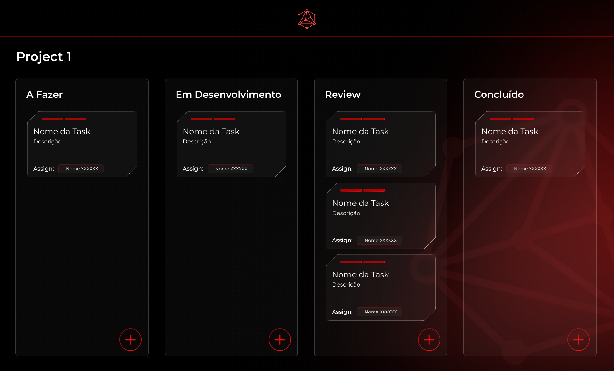
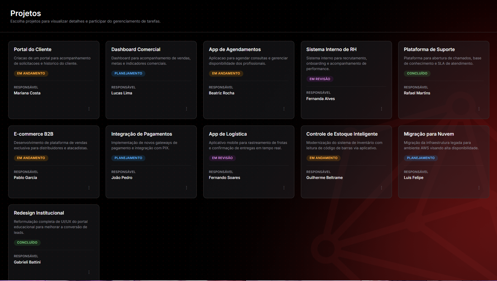
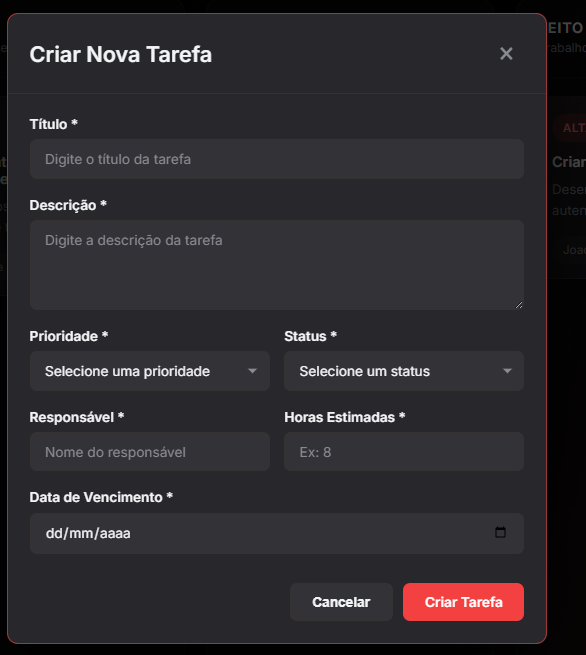
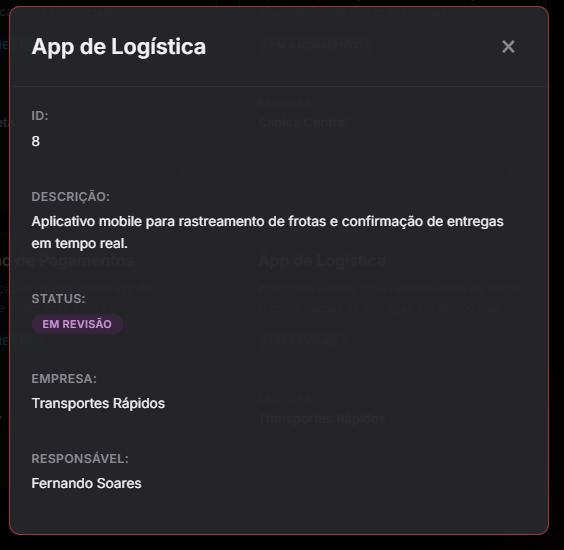
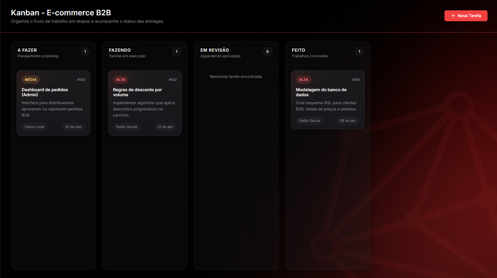

# Documentação da Entrega Individual

## 1. Informações Gerais

**Nome:** João Pedro Gonçalves Corrêa Araujo
**Grupo:** 3

Esta entrega individual apresenta a documentação e o raciocínio por trás do componente/tela desenvolvido. O foco é demonstrar a estruturação do pensamento, a criatividade no layout e a execução técnica utilizando HTML e CSS.

## 3. Protótipo de Alta Fidelidade

O protótipo de alta fidelidade desenvolvido foi da tela de Kanban, que é dividido entre quatro colunas principais: "A FAZER", "FAZENDO", "EM REVISÃO", CONCLUÍDO".

<br>

<br>

Dentro de cada coluna, as tarefas são representadas por cards estilizados que aplicam o conceito de glassmorphism (fundo escuro levemente translúcido com bordas finas) e apresentam um detalhe de recorte diagonal (chanfro) no canto inferior direito, inspirado nos cards presentes no site oficial da Inteli Jr.

Cada card contém as informações essenciais da demanda:

- Um indicador visual superior do andamento da tarefa.
- O título da tarefa ("Nome da Task").
- Um espaço para detalhes ("Descrição").
- A atribuição do responsável no canto inferior esquerdo ("Assign: Nome XXXXXX").

Na base de cada coluna, há um botão de ação flutuante circular com o ícone de adição ("+"), permitindo ao usuário criar novas tarefas diretamente no estágio específico do fluxo de trabalho. Completando a interface, no canto superior esquerdo identifica o painel como "Project 1", situado abaixo de um logotipo do Inteli Jr.

O protótipo de alta fidelidade foi feito no Figma. Segue o link para acesso:
https://www.figma.com/design/QJlMKQMPmWgzbJ6bPiLfrg/Untitled?node-id=1-2&t=s1AzOCVS8C1rETcD-1


## 2. Componente / Tela desenvolvida

## 2.1 Tela de Projetos

**Nome do componente:** Tela de Listagem de Projetos.

**Descrição:** Esta tela atua como o ponto de entrada e visão geral do sistema, exibindo todas as iniciativas ativas e passadas em um layout de grade (grid). Cada card resume informações cruciais: o título do projeto, uma breve descrição do escopo, o status atual com identificação visual por tags de cores ("Planejamento", "Em Andamento", "Em Revisão" e "Concluído") e o nome da pessoa responsável.  
Ao ser exibida, o sistema manda um ```GET /projects ``` na API disponibilizada pela equipe do Inteli JR. e alterada através de FORK pela nossa equipe. 


<br>

<br>

**Arquivos principais:**
  - `src/front_end/html/index.html`
  - `src/front_end/css/projetos.css`
  - `src/front_end/js/projetos.js` 

## 2.2 Modal de Novas Tarefas

**Nome do componente:** Modal de Criação de Nova Tarefa

**Descrição:*** Esta interface é um modal que apresenta um formulário estruturado para a inserção de novos itens de trabalho no sistema. O componente exige o preenchimento de campos essenciais (indicados por asteriscos), como título, descrição detalhada, prioridade, status inicial, profissional responsável, estimativa de horas e data de vencimento. 

Essa tela é exibida quando o usuário clica em **Nova Tarefa** no canto superior direito da tela do Kanban. Após o usuário pressionar em **Criar Tarefa**, o sistema manda um ```POST /tasks ``` na API disponibilizada pela equipe do Inteli JR. e alterada através de FORK pela nossa equipe. 

<br>

<br>

**Arquivos principais:**
  - `src/front_end/html/index.html`
  - `src/front_end/css/kanban.css`
  - `src/front_end/js/kanban.js`
  
## 2.3 Modal de Visualização de Projetos

**Nome do componente:** Modal de Detalhes do Projeto.

Descrição: Esta interface é um modal projetado para exibir informações detalhadas e específicas de um único projeto selecionado. Ela apresenta dados complementares que não cabem na visão resumida da listagem principal, como o ID numérico de controle, a descrição completa do escopo, o status atual (destacado por uma tag visual), a empresa/cliente associado e o profissional responsável pela demanda. 
O componente é exibido assim que o usuário clica nos 3 pontos presentes no card de um projeto na **Tela de Projetos**. Após o usuário pressionar em **Três Pontos**, o sistema manda um ```GET /projects/id ``` na API disponibilizada pela equipe do Inteli JR. e alterada através de FORK pela nossa equipe. 

<br>

<br>

**Arquivos principais:**
  - `src/front_end/html/index.html`
  - `src/front_end/css/projetos.css`
  - `src/front_end/js/projetos.js`

## 2.4 Tela de Kanban

**Nome do componente:** Painel Kanban.

**Descrição:** Esta tela funciona como um centro de controle visual para o fluxo de trabalho de um projeto. Ela utiliza a metodologia Kanban para organizar tarefas em quatro estágios sequenciais: "A Fazer", "Em Desenvolvimento", "Review" (Em Revisão) e "Concluído". Ao ser exibida, o sistema manda um ```GET /tasks/id ``` na API disponibilizada pela equipe do Inteli JR. e alterada através de FORK pela nossa equipe. 


<br>

<br>

**Arquivos principais:**
  - `src/front_end/html/index.html`
  - `src/front_end/css/kanban.css`
  - `src/front_end/js/kanban.js`

## 4. Resumo de Tarefas

Tarefas realizadas por mim neste projeto:

- **Criação do repositório base**
- **Documentação base do Read-ME**
- **Criação da tela de projetos:** Fetch básico na API para GET dos projetos e desenvolvimento do HTML e CSS.
- **Criação da tela de Kanban:** Fetch básico na API para GET das tarefas do Kanban e desenvolvimento do HTML e CSS.
- **Criação da Criar Tarefa:** Fetch básico na API para POST de novas tarefas no Kanban.
- **Criação do Modal de Visualização:** Fetch básico na API para GET de informações de projetos específicos.
- **Criação do Background Padrão:** Criação do Background base do projeto.
- **Design do site:** Alteração em diferentes telas para garantir que todas possuam um design consistente.

## 5. Uso de IA

Eu, João Pedro Gonçalves Corrêa Araujo, utilizei o Gemini para auxílio na criação do **Modal da tela de Projetos** e para realizar a movimentação de cards entre diferentes colunas e na padronização de algumas telas criadas por outros integrantes, para que a identidade visual do site, fosse consistente e única.

