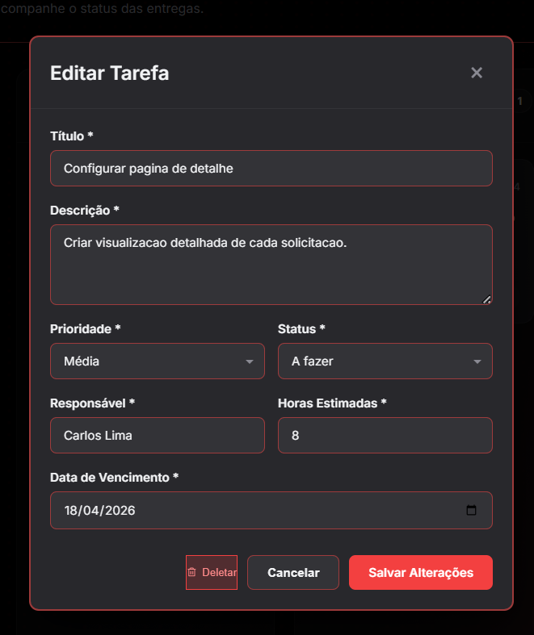
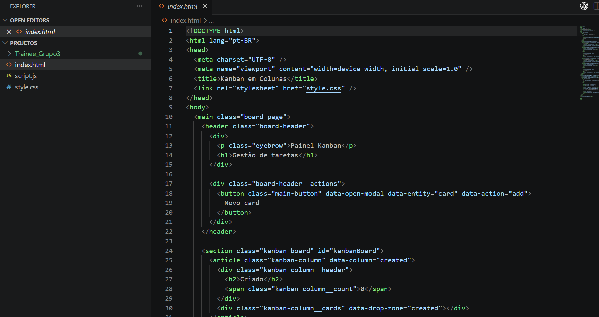
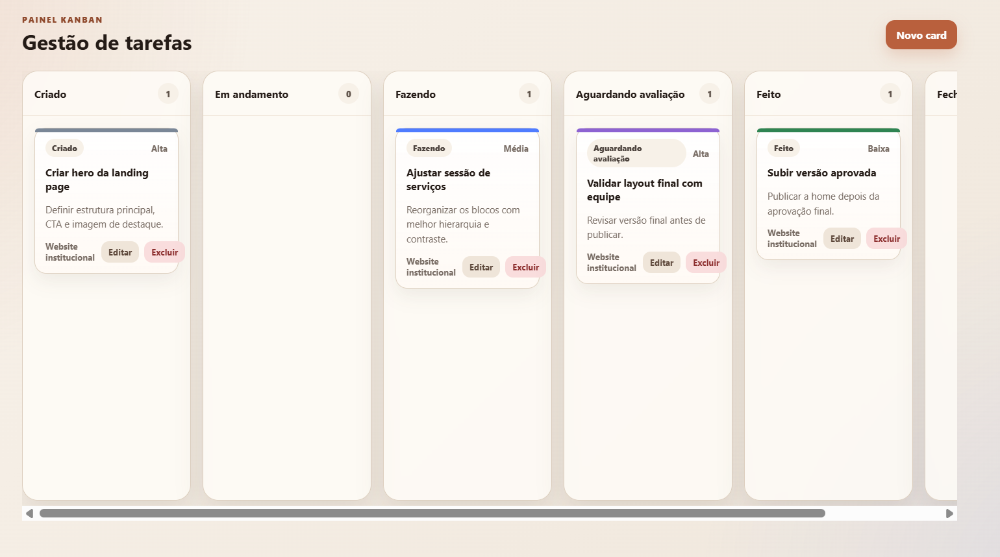
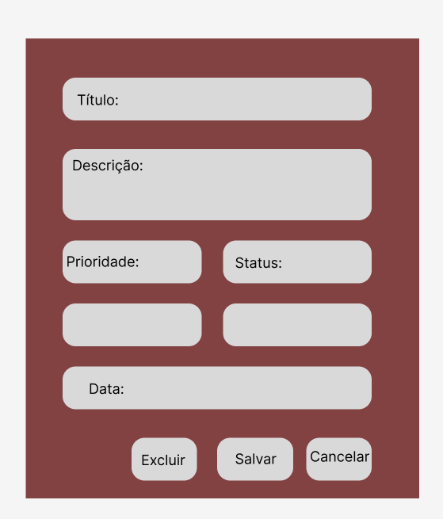

# Contribuição Individual – Laís Victoria

---

## ### Introdução
Durante o desenvolvimento do projeto, minha atuação esteve focada tanto na **evolução prática da aplicação**, quanto na **organização e clareza da documentação**. Busquei contribuir de uma forma funcional, implementando uma melhoria direta na usabilidade do sistema, além de garantir que o projeto estivesse bem estruturado e compreensível para qualquer pessoa que viesse a analisá-lo.

---

## Funcionalidades Desenvolvidas

### Aba de Edição de Kanban
Fui responsável pela criação de uma **aba dedicada à edição de Kanbans**, permitindo que o usuário pudesse modificar informações, mesmo após a criação de um card.

Essa funcionalidade foi desenvolvida como um **diferencial**, não sendo obrigatória inicialmente, com o objetivo de enriquecer a experiência do usuário dentro do site do Inteli Júnior.

**Principais pontos da implementação:**
- Estruturação da interface de edição  
- Manipulação do DOM para atualização dinâmica das informações  
- Integração com os elementos já existentes do sistema  

> 

---

### Protótipo Transformado em Código e Figma
Além da funcionalidade final, também desenvolvi a **versão em código de um dos rascunhos de tela do Kanban**, transformando uma ideia inicial em uma interface funcional.

Isso contribuiu para:
- Validar a estrutura visual proposta  
- Testar a usabilidade na prática  
- Antecipar possíveis melhorias antes da implementação final  

> 

> 

  Além disso, para rascunho de ideia da aba do kanbam no qual o usuário consegue editar, utilizei o Figma. Fiz um design manual para poder basear na ideia final.

> 
---

## Documentação

Também tive participação ativa na **construção e melhoria da documentação do projeto**, garantindo que as informações estivessem claras, organizadas e coerentes.

**Minhas contribuições incluíram:**
- Estruturação das seções do documento  
- Escrita e revisão de conteúdos  
- Padronização da linguagem utilizada  
- Organização geral para melhor leitura e entendimento  

Essa parte foi essencial para tornar o projeto mais acessível tanto para avaliadores quanto para outros desenvolvedores.

---

## Tecnologias Utilizadas

- HTML  
- CSS  
- JavaScript  

---

## Impacto no Projeto

Minhas contribuições impactaram diretamente em:

- **Melhoria da usabilidade**, com a funcionalidade de edição  
- **Evolução prática do sistema**, transformando ideias em implementação  
- **Clareza e organização da documentação**, facilitando o entendimento geral do projeto  

---

## Uso de Inteligência Artificial

Utilizei ferramentas de Inteligência Artificial como apoio principalmente para:

- Auxílio na construção de funções em JavaScript  
- Esclarecimento de dúvidas durante o desenvolvimento  
- Suporte pontual na organização de ideias  

O uso foi feito de forma complementar, mantendo o controle sobre a lógica e estrutura do que estava sendo desenvolvido.

---

##  Conclusão

Minha participação no projeto foi focada em transformar ideias em funcionalidades reais, além de garantir que todo o processo estivesse bem documentado. Busquei contribuir de forma consistente, agregando valor tanto na experiência do usuário quanto na organização do projeto como um todo.