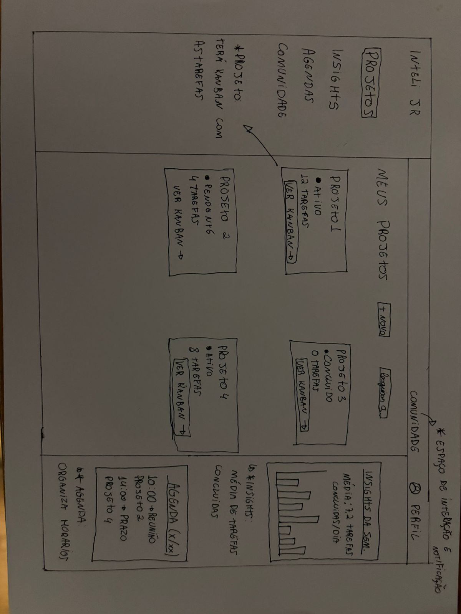
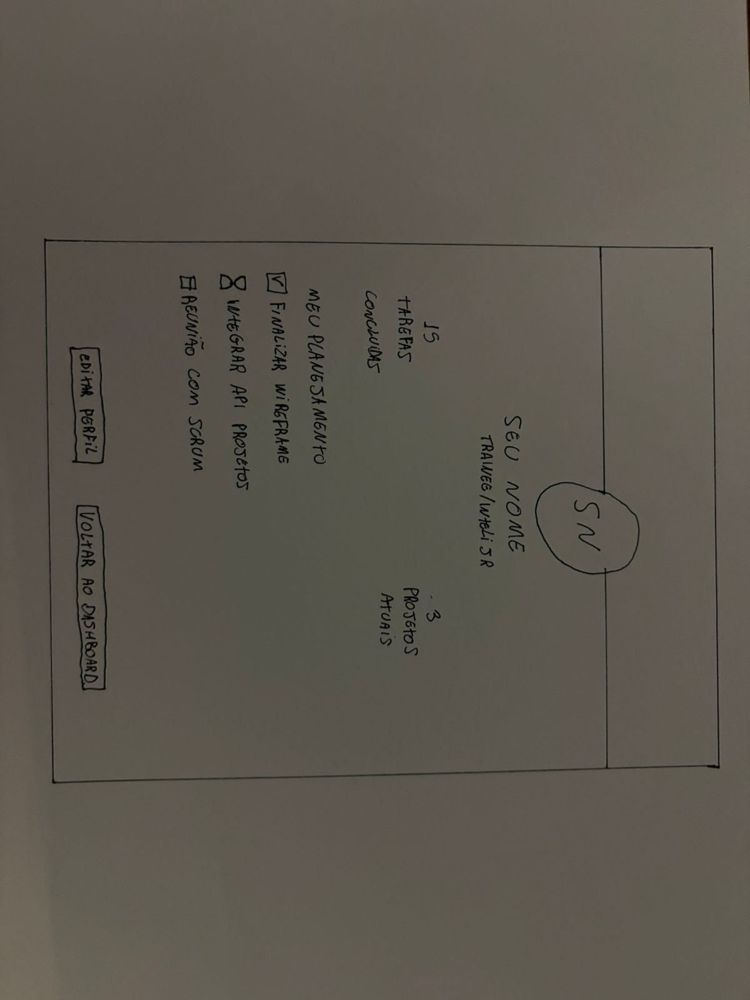

# Relatório de Contribuições - Trainee Inteli Júnior
## Luis Felipe Campagnaro Copolillo

### Introdução
Durante minha participação no projeto do Inteli Jr., precisei lidar com uma limitação de tempo devido ao meu retorno à minha cidade natal. Essa situação foi devidamente comunicada à minha Scrum Master, permitindo um alinhamento claro sobre minhas responsabilidades dentro do projeto. Diante disso, fiquei encarregado de revisar a documentação existente e desenvolver dois wireframes, sendo um referente à tela de perfil e outro ao menu da aplicação. Essas entregas contribuíram para a organização e evolução das definições de interface do projeto. Mesmo com a disponibilidade reduzida, mantive presença ativa nas reuniões da equipe, onde pude acompanhar o andamento das atividades e colaborar com sugestões relevantes. Dessa forma, busquei contribuir de maneira consistente dentro das minhas possibilidades, apoiando o time no desenvolvimento do projeto.

---

### Wireframe
1. **Wireframe menu:** 
> 
2. **Wireframe perfil:** 
> 

Ambas foram feitas a mão.

---

## Uso de Inteligência Artificial

utilizei ferramentas de Inteligência Artificial como apoio no processo de criação dos wireframes. Por meio delas, busquei referências de modelos de menu e tela de perfil utilizados por diferentes empresas, com o objetivo de entender padrões de design e boas práticas de usabilidade.  Essas referências serviram como base para a construção dos wireframes, permitindo que eu desenvolvesse propostas mais alinhadas com interfaces já consolidadas no mercado. Dessa forma, consegui otimizar o processo de criação e garantir maior consistência nas soluções apresentadas.

---

## Conclusão
Como conclusão, minha participação no projeto do Inteli Jr. foi marcada por uma limitação de tempo, decorrente do meu retorno à minha cidade natal, o que impactou diretamente minha disponibilidade para atuar de forma mais ampla nas atividades. Ainda assim, essa situação foi previamente alinhada com a Scrum Master, permitindo uma definição clara das minhas responsabilidades. Dessa forma, procurei aproveitar ao máximo o tempo disponível, garantindo uma participação ativa dentro das minhas possibilidades.