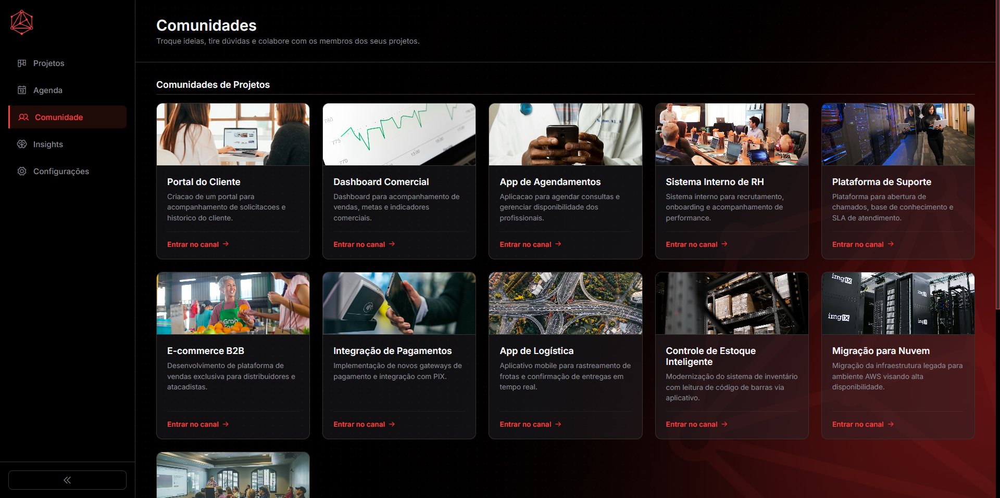
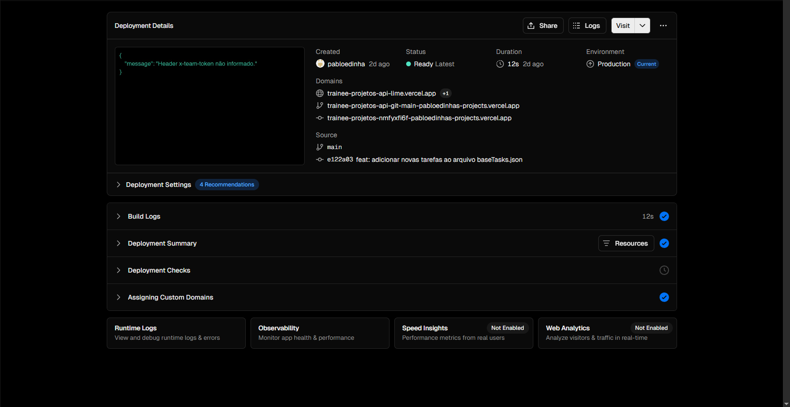
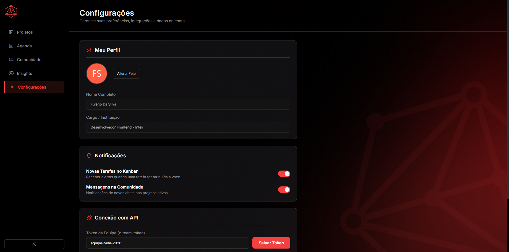

# Relatório de Contribuições - Trainee Inteli Júnior
## Pablo Oliveira Garcia

### Introdução
Como integrante, uma das minhas primeiras contribuições foi estipular a ideia de se basear no visual do site da IJ, como estamos fazendo uma plataforma para o clube, nada mais justo do que ter como identidade visual algo que remeta à ele. Porém, minhas contribuições concretas vão muito além disso! Minha atuação transitou entre parte do design de interface da aplicação WEB (CSS), a experiência do usuário e a evolução total da infraestrutura de dados da nossa aplicação com o fork da API, além da criação de telas extras baseadas em como a plataforma funcionaria.

---

## Design e Identidade Visual
Como eu já disse, auxiliei muito na parte de estruturar o visual do site, utilizando como referência estética o site oficial da IJ. O objetivo foi criar uma interface que parecesse uma extensão natural do ecossistema que o clube já tem, prezando pelo profissionalismo e minimalismo com uma página que tem cores predominantes presentes na própria logo, o vermelho e o preto.

> **Imagem da aba comunidades destacando as cores e identidade visual:**
> 

### Prototipagem
Fui responsável pela prototipagem de duas frentes fundamentais do projeto:
1. **Kanban de Tarefas:** Estruturado para ser o coração do gerenciamento do projeto.
2. **Tela de Comunidades:** Uma ideia autoral para integrar "rodas de conversa" e canais de comunicação (estilo Slack) diretamente na plataforma, facilitando a troca de informações entre os membros para cada projeto ou comunidades pessoais.

> **Protótipo 1 (Kanban):**
> 

> **Protótipo 2 (Comunidades):**
> 

Ambas foram feitas usando o **Figma** como ferramenta principal.

---

## Evolução Técnica e API
Devido à necessidade de uma tela de comunidades mais robusta e visual, assumi a responsabilidade de evoluir nossa fonte de dados. Eu aproveitei dessa chance para entender e realmente aprender a manipular APIs, eu nunca tinha mexido com isso anteriormente, mas foi mais fácil do que eu imaginava.
* **Fork e Customização:** Realizei o fork da API original e consegui incluir mais tarefas e projetos, para a nossa plataforma simular um período de produção carregado.
* **Dados Visuais:** Integrei URLs de imagens externas para que cada projeto tivesse uma identidade visual única nos cards da comunidade.
* **Deploy:** Realizei o deploy da nova API no **Vercel**, garantindo que o grupo pudesse utilizar uma versão diferente da original.

> **Imagem do site do Vercel e link da API:**
>https://trainee-projetos-api-lime.vercel.app.
> 

---

## Funcionalidades e Componentes
Além das telas principais, trabalhei no desenvolvimento de funcionalidades que melhoram a usabilidade do sistema:

* **Sidebar Retrátil:** Implementei a lógica de esconder/mostrar a barra lateral para otimizar o espaço de trabalho do usuário.
* **Tela de Configurações:** Estrutura desenvolvida para dar corpo ao projeto, utilizei ferramentas de IA para buildar essa tela, eu não fazia ideia do que colocar dentro dela, então pedi ajuda para definir parâmetros de perfil e preferências que tornassem a plataforma mais completa, não está totalmente funcional.
* **Integração da Agenda:** Adaptei o componente da agenda que a Gabrieli Battini fez, garantindo que a tela dela seguisse o padrão visual que definimos para o site.

> **Tela de configurações:**
> 

---

## Uso de Inteligência Artificial

Eu usei Inteligência no desenvolvimento de algumas coisas durante o case, a IA que eu usei foi o Gemini. Eu dei um contexto para ele do case e pedi ajuda no wireframe, mais especificamente para ele me dar uma ideia de coisas que eu poderia colocar nos dois protótipos que eu fiz. 
Já no desenvolvimento concreto mesmo, eu pedia muita ajuda nos arquivos JS, eu nunca tive grandes chances de aprender JavaScript, então tenho dificuldade em fazer funções sozinho e linkar com o front das páginas. O funcionamento da página de configurações, mais especificamente o botão de limpar os chats da aba de comunidade foi feito com IA também.
Na aba comunidades, eu também não tinha ideia de como fazer um chat mockado, então também usei as instruções da IA.
Eu tentei evitar de usar na estrutura HTML e no design, normalmente ela não consegue replicar o que a gente idealiza para o visual da plataforma.
Sobre o fork na API, eu pedi ajuda do Gemini para me dar instruções de como fazer as alterações e como efetuar o deploy.

---

## Conclusão
Minha participação neste processo seletivo foi pautada pela vontade de entregar algo que fosse além do básico. Ao assumir o controle da API e propor a tela de comunidades, meu objetivo foi mostrar que uma plataforma de gestão pode ser, ao mesmo tempo, técnica e social.